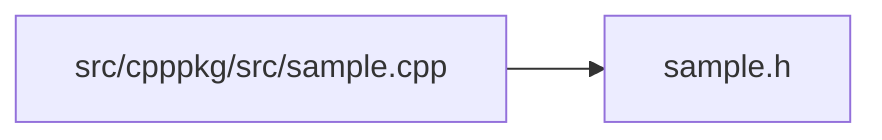

<a id="sample_8cpp"></a>
# File sample.cpp

![][C++]

**Location**: `src/cpppkg/src/sample.cpp`


## Namespaces

* [cpppkg](namespacecpppkg.md#namespacecpppkg)

## Includes

* [sample.h](sample_8h.md#sample_8h)





## Source


```cpp
#include "sample.h"

namespace cpppkg {

int Calculator::add(int a, int b) {
    return a + b;
}

int Calculator::multiply(int a, int b) {
    return a * b;
}

}
```


[C++]: https://img.shields.io/badge/language-C%2B%2B-blue (C++)