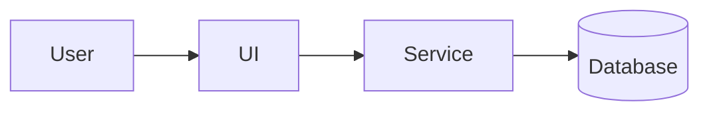

# Architecture Overview

# Diagram

## High-Level Components
- Component A — purpose, inputs/outputs
- Component B — ...

## Interactions
Describe how components communicate.
- See [System Diagram](system_diagram.md)
- See [Component diagrams](component_diagrams/)

## Constraints & Trade-offs
- Performance, cost, complexity, hardware constraints (if any)
